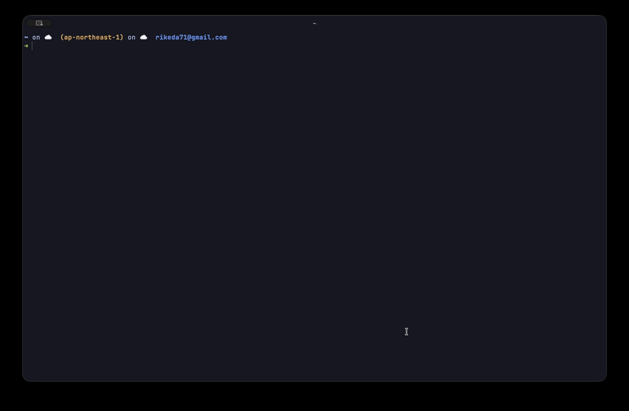
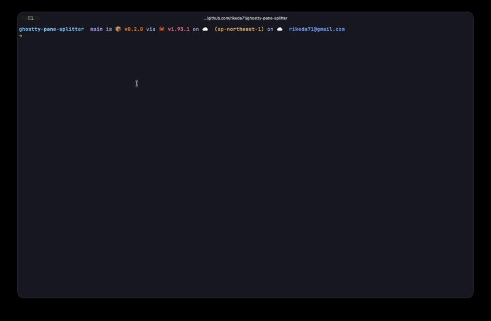

# ghostty-pane-splitter

[](https://github.com/rikeda71/ghostty-pane-splitter/actions/workflows/ci.yml)
[](https://crates.io/crates/ghostty-pane-splitter)
[](LICENSE)

**[日本語版 README はこちら](README.ja.md)**

CLI tool to split panes on Ghostty Terminal.

Automates Ghostty's pane splitting by simulating keyboard inputs via [enigo](https://github.com/enigo-rs/enigo), enabling cross-platform support (macOS / Linux).



## Use with AI Coding Agents

Ghostty is becoming the terminal of choice for CLI-based AI coding agents like [Claude Code](https://code.claude.com/) and [Codex CLI](https://github.com/openai/codex). Use `ghostty-pane-splitter` to instantly set up multi-pane layouts — run your AI agent in one pane, your editor in another, and a dev server in a third, all with a single command.

```bash
# 3-pane layout: Left: AI agent, Right-top: editor, Right-bottom: terminal
ghostty-pane-splitter 1,2

# 4-pane layout for running multiple agents in parallel with git worktrees
ghostty-pane-splitter 4
```

Running multiple AI agents in parallel with [git worktrees](https://git-scm.com/docs/git-worktree) is a popular productivity pattern. `ghostty-pane-splitter` lets you set up multi-agent layouts instantly — no tmux required.

## Usage

```
ghostty-pane-splitter <LAYOUT>
```

`<LAYOUT>` accepts a pane count, a grid spec (`COLSxROWS`), or a custom column layout (comma-separated row counts per column).

```bash
# Split into 4 panes (2x2 grid)
ghostty-pane-splitter 4

# Split into 6 panes (3x2 grid)
ghostty-pane-splitter 6

# Split into 2 cols x 3 rows
ghostty-pane-splitter 2x3

# Custom layout: left 1 pane, right 3 panes
ghostty-pane-splitter 1,3

# Custom layout: 3 columns with 2, 1, 3 rows
ghostty-pane-splitter 2,1,3

# Show version
ghostty-pane-splitter --version

# Show help
ghostty-pane-splitter --help
```

### Layout examples

| Input   | Result | Description |
|---------|--------|-------------|
| `2`     | 2x1    | 2 columns |
| `4`     | 2x2    | 2x2 grid |
| `6`     | 3x2    | 3 cols x 2 rows |
| `9`     | 3x3    | 3x3 grid |
| `2x3`   | 2x3    | Explicit grid spec |
| `1,3`   | 1+3    | Left: 1 pane, Right: 3 panes |
| `2,1,3` | 2+1+3  | 3 columns with 2, 1, 3 rows |

## Installation

### Homebrew (macOS)

```bash
brew install rikeda71/tap/ghostty-pane-splitter
```

### curl (GitHub Releases)

```bash
# macOS (Apple Silicon)
curl -fsSL https://github.com/rikeda71/ghostty-pane-splitter/releases/latest/download/ghostty-pane-splitter-aarch64-apple-darwin.tar.gz | tar xz
sudo mv ghostty-pane-splitter /usr/local/bin/

# macOS (Intel)
curl -fsSL https://github.com/rikeda71/ghostty-pane-splitter/releases/latest/download/ghostty-pane-splitter-x86_64-apple-darwin.tar.gz | tar xz
sudo mv ghostty-pane-splitter /usr/local/bin/

# Linux (x86_64)
curl -fsSL https://github.com/rikeda71/ghostty-pane-splitter/releases/latest/download/ghostty-pane-splitter-x86_64-unknown-linux-gnu.tar.gz | tar xz
sudo mv ghostty-pane-splitter /usr/local/bin/
```

### Cargo

```bash
cargo install ghostty-pane-splitter
```

### From source

```bash
git clone https://github.com/rikeda71/ghostty-pane-splitter.git
cd ghostty-pane-splitter
cargo install --path .
```

> **Note**: Linux requires `libxdo-dev` (`sudo apt install libxdo-dev`)

## Configuration

This tool reads keybindings directly from your Ghostty config file. Add the following keybindings to your Ghostty config:

```
keybind = super+d=new_split:right
keybind = super+shift+d=new_split:down
keybind = super+ctrl+right_bracket=goto_split:next
keybind = super+ctrl+left_bracket=goto_split:previous
keybind = super+ctrl+shift+equal=equalize_splits
```

Ghostty config file locations:
- **macOS**: `~/Library/Application Support/com.mitchellh.ghostty/config`
- **Linux**: `~/.config/ghostty/config`

The tool will show an error if the config file is not found or required keybindings are missing.

## Demo

| Type | Command | Demo |
|------|---------|------|
| Number | `ghostty-pane-splitter 9` |  |
| Grid | `ghostty-pane-splitter 2x2` |  |
| Custom | `ghostty-pane-splitter 1,4` |  |

## Requirements

- [Ghostty](https://ghostty.org/) terminal
- Linux: `libxdo-dev` (`sudo apt install libxdo-dev`)

## License

[MIT](LICENSE)
